# Python Otel 🐍

> A comprehensive microservices demonstration project showcasing Python auto-instrumentation with OpenTelemetry

## 📑 Table of Contents

- [Python Otel 🐍](#python-otel-)
  - [📑 Table of Contents](#-table-of-contents)
  - [About the Project](#about-the-project)
  - [Architecture](#architecture)
    - [Microservices](#microservices)
    - [Infrastructure](#infrastructure)
  - [Key Features](#key-features)
  - [Quick Start](#quick-start)
    - [Prerequisites](#prerequisites)
    - [Installation](#installation)
    - [Running with Docker Compose](#running-with-docker-compose)
    - [Useful URLs](#useful-urls)
  - [Configuration](#configuration)
    - [Environment Variables](#environment-variables)
    - [Configuration Structure](#configuration-structure)
    - [Error Simulation](#error-simulation)
  - [AI/LLM Integrations](#aillm-integrations)
    - [Docker AI Model Runner](#docker-ai-model-runner)
    - [Integration with n8n](#integration-with-n8n)
    - [Integration with Flowise](#integration-with-flowise)
    - [MCP (Model Context Protocol) in n8n](#mcp-model-context-protocol-in-n8n)
      - [Pre-requisite: Create Grafana Service Account 🔐](#pre-requisite-create-grafana-service-account-)
  - [Local Development](#local-development)
  - [Troubleshooting](#troubleshooting)
    - [GPU Support with NVIDIA Container Toolkit](#gpu-support-with-nvidia-container-toolkit)
      - [Prerequisites 📋](#prerequisites-)
      - [Installing NVIDIA Container Toolkit](#installing-nvidia-container-toolkit)
      - [Configuring Docker](#configuring-docker)
      - [Testing GPU Support](#testing-gpu-support)

---

## About the Project

This project is a set of microservices developed to visualize and understand Python auto-instrumentation with OpenTelemetry. It's a complete order and stock management application that demonstrates modern observability best practices.

## Architecture

### Microservices

The application consists of the following microservices:

- **customer** 🪵 - Kafka producer acting as a client for ordering wood
- **supplier** 🪵 - Kafka producer acting as a supplier to replenish stock
- **customercheck** 📦 - Kafka consumer serving as the order reception service
- **suppliercheck** 📊 - Kafka consumer managing stock levels
- **stock** 🏗️ - Stock management API
- **order** 📝 - Order management API
- **ordermanagement** 😄 - Service for updating order status

### Infrastructure

The complete application is containerized. The `docker-compose.yml` file builds all microservices and deploys the following components:

- **Kafka** 📨 - Cluster to receive orders and stock updates
- **PostgreSQL** 🗄️ - Relational database
- **Adminer** 📂 - Web interface for database visualization
- **Grafana** 📊 - Standard visualization tool
- **Grafana with MCP support** 🤖 - Enhanced Grafana with Model Context Protocol for AI integration
- **Loki** 📝 - Log database
- **Mimir** 📈 - Metrics database
- **Tempo** 📍 - Traces database
- **Otel Gateway** 🛠️ - API for receiving observability data
- **n8n** 🔄 - Workflow automation tool

## Key Features

✨ **Simulated Error Scenarios** - Built-in error simulation with configurable error rate via `ERROR_RATE` environment variable

✨ **Comprehensive Observability** - Full OpenTelemetry auto-instrumentation with traces, metrics, and logs

✨ **Docker-First Architecture** - Complete containerization with optimized build settings

✨ **Flexible Configuration** - Environment-based configuration for easy deployment

✨ **AI Integration Ready** - Includes Grafana with MCP support for AI-powered observability

## Quick Start

### Prerequisites

- Docker and Docker Compose
- Git
- (Optional) NVIDIA GPU and drivers for AI/LLM features
- (Optional) uv for local development (`pip install uv`)

### Installation

1. Clone the repository
2. Copy and configure environment variables:

```bash
cp .env.example .env
# Edit .env with your specific settings, especially:
# - LLM_BASE_URL (default: http://172.17.0.1:12434/v1)
# - LLM_MODEL (default: ai/qwen3:0.6B-Q4_0)
# - GRAFANA_SERVICE_ACCOUNT_TOKEN (required for MCP agents)
```

### Running with Docker Compose

```bash
# Start all services (including agentic network)
docker-compose up -d

# Build and start
docker-compose up --build -d

# Start only specific services
docker-compose up -d grafana loki mimir tempo agent-orchestrator agents-ui

# Stop all services
docker-compose down

# Complete cleanup (remove volumes and images)
docker-compose down -v --rmi all
```

### Quick Start - Agentic Network 🤖

To use the intelligent observability agents:

1. **Ensure Grafana MCP is configured**:
   ```bash
   # Create a Grafana service account token (see "Pre-requisite" section below)
   # Add to .env:
   GRAFANA_SERVICE_ACCOUNT_TOKEN=eyJ...your-token...
   ```

2. **Start the agent services**:
   ```bash
   docker-compose up -d agent-orchestrator agent-logs agent-metrics agent-traces agents-ui
   ```

3. **Access the Web UI**:
   - Open http://localhost:3002/ in your browser
   - Ask natural language questions like:
     - "Show me errors in the order service"
     - "What's the CPU usage of customer service?"
     - "Analyze slow traces in the last hour"

4. **Direct API access** (alternative to UI):
   ```bash
   # Query the orchestrator API directly
   curl -X POST http://localhost:8001/analyze \
     -H "Content-Type: application/json" \
     -d '{"query": "Show errors in order service", "time_range": "1h"}'
   ```

### Useful URLs

| Service                | URL                    | Description                           |
| ---------------------- | ---------------------- | ------------------------------------- |
| Grafana (Standard)     | http://localhost:3000/ | Main observability dashboard 📊        |
| AKHQ                   | http://localhost:8080/ | Kafka management UI 🛠️                 |
| Adminer                | http://localhost:8081/ | Database administration 🗃️             |
| n8n                    | http://localhost:5678/ | Workflow automation 🔄                 |
| Flowise                | http://localhost:3001/ | AI workflow builder 🤖                 |
| **Agentic Network**    |                        |                                       |
| Agents Web UI          | http://localhost:3002/ | Chat interface for agent queries 💬    |
| Orchestrator API       | http://localhost:8001/ | Main agent coordinator API 🎯          |
| Logs Agent API         | http://localhost:8002/ | Specialized logs analysis API 📜       |
| Metrics Agent API      | http://localhost:8003/ | Specialized metrics analysis API 📊    |
| Traces Agent API       | http://localhost:8004/ | Specialized traces analysis API 🛤️     |

## Configuration

### Environment Variables

All image versions and registry configuration are managed through environment variables. The project includes:

- **`.env.example`** - Template with all available configuration options and documentation
- **`.env`** - Your local configuration (not tracked in git)

Key configuration options:

```bash
# Docker Registry Configuration
DOCKER_REGISTRY=                    # Leave empty for Docker Hub

# Core Services
IMG_GRAFANA=grafana/grafana:12.0.2      # Standard Grafana
IMG_GRAFANA_MCP=mcp/grafana:latest       # Grafana with MCP support
IMG_LOKI=grafana/loki:3.5.2              # Log aggregation
IMG_TEMPO=grafana/tempo:2.8.1            # Distributed tracing
IMG_MIMIR=grafana/mimir:2.16.1           # Metrics storage

# Additional Tools
IMG_N8N=n8nio/n8n:1.112.0               # Workflow automation
IMG_OTEL=otel/opentelemetry-collector-contrib:0.130.1  # OTEL collector

# Performance Optimizations
COMPOSE_PARALLEL_LIMIT=8                 # Parallel container builds
DOCKER_BUILDKIT=1                        # Enable BuildKit

# Agentic Network Configuration
LLM_BASE_URL=http://172.17.0.1:12434/v1  # Local LLM endpoint (Docker Model Runner)
LLM_API_KEY=not-needed                   # API key (not required for local LLM)
LLM_MODEL=ai/qwen3:0.6B-Q4_0             # Model name
GRAFANA_SERVICE_ACCOUNT_TOKEN=<token>    # Required for MCP agents
```

### Configuration Structure

The project has been reorganized with a cleaner configuration structure:

```
config/
├── grafana/
│   └── datasources/
│       └── default.yaml          # Configuration des datasources Grafana
├── loki/
│   └── loki-config.yml          # Configuration Loki
├── mimir/
│   └── mimir-config.yml         # Configuration Mimir
├── otel/
│   └── otel-conf.yml            # Configuration du collecteur OpenTelemetry
└── tempo/
    └── tempo.yml                # Configuration Tempo
```

### Error Simulation

🎭 The application includes built-in error simulation for testing observability:

- **Customer Service** - Simulates Kafka/network failures when sending orders
- **Supplier Check Service** - Simulates API/network failures when processing stock updates
- **Configurable Error Rate** - Set `ERROR_RATE` environment variable (default: 0.1 = 10%)

Example configuration:

```bash
# In docker-compose.yml or your environment
ERROR_RATE=0.2  # 20% error rate for testing
```

## Agentic Network Architecture 🤖

### Overview

This project supports an **agentic network architecture** for intelligent observability analysis. The system uses specialized AI agents that communicate with the Grafana MCP (Model Context Protocol) server to analyze logs, metrics, and traces.

### Architecture Diagram

```mermaid
graph TB
    subgraph "User Interface"
        UI[Web Chat Interface<br/>FastAPI + React/Streamlit]
    end

    subgraph "Agentic Network"
        ORCH[🎯 Orchestrator Agent<br/>Request routing & synthesis]
        LOGS[📜 Logs Agent<br/>Pattern analysis]
        METRICS[📊 Metrics Agent<br/>Anomaly detection]
        TRACES[🛤️ Traces Agent<br/>Performance analysis]
    end

    subgraph "MCP Layer"
        MCP[Grafana MCP Server<br/>:8000/sse<br/>Unified API Gateway]
    end

    subgraph "Grafana Stack Datasources"
        LOKI[(Loki<br/>Logs Database)]
        MIMIR[(Mimir<br/>Metrics Database)]
        TEMPO[(Tempo<br/>Traces Database)]
    end

    subgraph "Monitored Services"
        SERVICES[Microservices:<br/>customer, order, stock,<br/>supplier, ordermanagement,<br/>ordercheck, suppliercheck]
    end

    UI -->|User Query| ORCH
    ORCH -->|Route to specialists| LOGS
    ORCH -->|Route to specialists| METRICS
    ORCH -->|Route to specialists| TRACES
    
    LOGS -->|MCP Protocol| MCP
    METRICS -->|MCP Protocol| MCP
    TRACES -->|MCP Protocol| MCP
    
    MCP -->|Query| LOKI
    MCP -->|Query| MIMIR
    MCP -->|Query| TEMPO
    
    SERVICES -->|OTLP| LOKI
    SERVICES -->|OTLP| MIMIR
    SERVICES -->|OTLP| TEMPO
    
    ORCH -.->|Synthesized<br/>Answer| UI

    style UI fill:#e1f5ff
    style ORCH fill:#fff4e1
    style LOGS fill:#ffe1e1
    style METRICS fill:#e1ffe1
    style TRACES fill:#f0e1ff
    style MCP fill:#ffd700
    style LOKI fill:#f76707
    style MIMIR fill:#12b886
    style TEMPO fill:#7950f2
```



### Agent Specializations

#### 🎯 Orchestrator Agent
- **Role**: Main coordinator and request dispatcher
- **Responsibilities**:
  - Analyze user questions in natural language
  - Route requests to specialized agents (parallel execution)
  - Synthesize responses from multiple agents
  - Provide coherent answers with context
- **Example**: "Why is the order service failing?" → Routes to Logs + Metrics + Traces agents

#### 📜 Logs Agent (Loki)
- **Role**: Log pattern analysis and error detection
- **Capabilities**:
  - Search error patterns across services
  - Temporal log analysis
  - Correlation by service_name, trace_id
  - Extract error messages and stack traces
- **MCP Queries**: LogQL via Grafana MCP
- **Example**: Find "Simulated DB error" in service=order

#### 📊 Metrics Agent (Mimir)
- **Role**: Performance metrics and anomaly detection
- **Capabilities**:
  - CPU, memory, request rate analysis
  - Latency detection (p50, p95, p99)
  - Trend analysis over time
  - Threshold-based alerting
- **MCP Queries**: PromQL via Grafana MCP
- **Example**: Detect HTTP 500 spikes on /orders endpoint

#### 🛤️ Traces Agent (Tempo)
- **Role**: Distributed tracing and service dependency analysis
- **Capabilities**:
  - Identify slow spans and bottlenecks
  - Service dependency mapping
  - Error propagation analysis
  - Request flow visualization
- **MCP Queries**: TraceQL via Grafana MCP
- **Example**: Analyze customer → ordercheck → order flow

### Communication Flow

1. **User Input** → Web Interface
2. **Orchestrator** receives question and determines which agents to invoke
3. **Specialized Agents** execute in parallel via MCP:
   ```
   Logs Agent → MCP → Loki
   Metrics Agent → MCP → Mimir
   Traces Agent → MCP → Tempo
   ```
4. **MCP Server** acts as unified gateway:
   - Handles authentication (GRAFANA_SERVICE_ACCOUNT_TOKEN)
   - Translates agent requests to datasource-specific queries
   - Returns structured data
5. **Orchestrator** synthesizes results into human-readable answer
6. **Web Interface** displays answer with optional Grafana links

### Key Benefits

✅ **Unified Interface** - Agents only need to know MCP protocol, not individual datasource APIs  
✅ **Centralized Auth** - Single service account token for all datasources  
✅ **Abstraction** - MCP handles LogQL/PromQL/TraceQL complexity  
✅ **Parallel Analysis** - Multiple agents query simultaneously  
✅ **Context-Aware** - Agents understand microservices architecture  
✅ **Intelligent Synthesis** - Orchestrator correlates findings across logs/metrics/traces

### Example Use Case

**Question**: "Analyze problems with the order service in the last hour"

**Orchestrator** dispatches to all 3 agents in parallel:

**Logs Agent Response**:
```
Found 47 errors in order service:
- 42x "Simulated DB insertion error" (ERROR_RATE=0.1)
- 5x "Unexpected error during order creation"
Time range: 14:00-15:00
```

**Metrics Agent Response**:
```
order service metrics anomalies:
- HTTP 500 rate: 10.2% (expected: <1%)
- Request latency p95: 245ms (baseline: 180ms)
- Database connection pool: 18/20 used
```

**Traces Agent Response**:
```
Analyzed 150 traces containing 'order':
- 15 failed spans in ordercheck→order flow
- Average failed span duration: 312ms
- Error propagation: customer→ordercheck→order→postgres
```

**Synthesized Answer**:
```
The order service has a 10% error rate due to simulated DB failures 
(ERROR_RATE environment variable). This affects the entire order 
processing pipeline from customer requests through to database 
insertion. Recommend: Check ERROR_RATE configuration or investigate 
actual DB connection issues if this is production data.

[View in Grafana] [Show Traces] [Export Report]
```

---

## AI/LLM Integrations

### Docker AI Model Runner

🤖 Docker Model Runner (DMR) lets you run and manage AI models locally using Docker. Particularly useful for the AI/LLM features in this project.

For installation and setup instructions, refer to the [Docker Model Runner documentation](https://docs.docker.com/ai/model-runner/get-started/#docker-engine).

### Integration with n8n

🔗 To configure AI features in n8n using Docker Model Runner:

1. In n8n, create an **OpenAI** credential type
2. Use a dummy token (e.g., `dummy-token`)
3. Set the base URL to: `http://172.17.0.1:12434/engines/llama.cpp/v1`

This allows n8n to connect to your local Docker Model Runner instance for AI/LLM capabilities.

### Integration with Flowise

🔗 To configure AI features in Flowise using Docker Model Runner:

1. In Flowise, use the **ChatLocalAI** chat model
2. Set the **Base Path** to: `http://172.17.0.1:12434/engines/llama.cpp/v1`
3. Set the **Model Name** to: `ai/qwen3`

This allows Flowise to connect to your local Docker Model Runner instance for AI/LLM capabilities.

### MCP (Model Context Protocol) in n8n

🛰️ If you want to enable Grafana MCP integration inside n8n (for context enrichment / model context), configure a separate credential or webhook using the Server Sent Events transport with the following URL:

- **Transport**: Server Sent Events (SSE)
- **URL**: `http://grafana-mcp:8000/sse`

Important notes:

- Use the SSE transport when configuring the MCP server/transport in n8n so Grafana MCP can stream context updates
- The hostname `grafana-mcp` matches the internal Docker Compose service name used in this project; when running n8n inside the same Compose network, this resolves to the MCP service

#### Pre-requisite: Create Grafana Service Account 🔐

Before using the MCP server from n8n, create a Grafana service account and copy its token into your `.env` file:

1. In Grafana, go to Configuration → Service accounts → Create service account
2. Create a token for the account and copy the token value
3. Add the token to your `.env`:

```bash
GRAFANA_SERVICE_ACCOUNT_TOKEN=eyJ...your-token...
```

After setting the token, restart the MCP service so Grafana picks up the new credentials:

```bash
docker compose restart grafana-mcp
```

## Local Development

🐛 Each microservice is set up with **uv**, so you can launch the different services using `uv run`.

Locally, you'll need to modify `PYTHONPATH` to include the project and access the "common" part.

To run a microservice with auto-instrumentation:

```bash
uv run opentelemetry-instrument \
    --traces_exporter otlp \
    --metrics_exporter otlp \
    --service_name customer2 \
    --exporter_otlp_endpoint http://localhost:4318 \
    --log_level debug \
    python -m order.main
```

## Troubleshooting

### GPU Support with NVIDIA Container Toolkit

For AI/LLM features (like the n8n AI models), you need GPU support in Docker. This requires the NVIDIA Container Toolkit.

#### Prerequisites 📋

First, check if your GPU is detected:

```bash
nvidia-smi
```

You should see your GPU information. If this command fails, install NVIDIA drivers first.

#### Installing NVIDIA Container Toolkit

For Fedora/RHEL/CentOS:

```bash
# Configure the production repository
curl -s -L https://nvidia.github.io/libnvidia-container/stable/rpm/nvidia-container-toolkit.repo | \
  sudo tee /etc/yum.repos.d/nvidia-container-toolkit.repo

# Install the toolkit
sudo dnf install -y nvidia-container-toolkit
```

#### Configuring Docker

After installation, configure Docker to use the NVIDIA runtime:

```bash
# Configure the container runtime
sudo nvidia-ctk runtime configure --runtime=docker

# Restart Docker daemon
sudo systemctl restart docker
```

#### Testing GPU Support

Test that Docker can access your GPU:

```bash
# Test with a simple CUDA container
docker run --rm --gpus all nvidia/cuda:11.0.3-base-ubuntu20.04 nvidia-smi
```

If successful, you should see your GPU information displayed within the container.

For more details, see the [official NVIDIA Container Toolkit documentation](https://docs.nvidia.com/datacenter/cloud-native/container-toolkit/latest/install-guide.html).
