# Agentic Network Architecture 🤖

## Overview

This project features an **agentic network architecture** for intelligent observability analysis. The system uses specialized AI agents that communicate with the Grafana MCP (Model Context Protocol) server to analyze logs, metrics, and traces.

## Architecture Diagram

```mermaid
graph TB
    subgraph "User Interface"
        UI[Web Chat Interface<br/>FastAPI + React/Streamlit]
    end

    subgraph "Agentic Network"
        ORCH[🎯 Orchestrator Agent<br/>Request routing & synthesis]
        LOGS[📜 Logs Agent<br/>Pattern analysis]
        METRICS[📊 Metrics Agent<br/>Anomaly detection]
        TRACES[🛤️ Traces Agent<br/>Performance analysis]
    end

    subgraph "MCP Layer"
        MCP[Grafana MCP Server<br/>:8000/sse<br/>Unified API Gateway]
    end

    subgraph "Grafana Stack Datasources"
        LOKI[(Loki<br/>Logs Database)]
        MIMIR[(Mimir<br/>Metrics Database)]
        TEMPO[(Tempo<br/>Traces Database)]
    end

    subgraph "Monitored Services"
        SERVICES[Microservices:<br/>customer, order, stock,<br/>supplier, ordermanagement,<br/>ordercheck, suppliercheck]
    end

    UI -->|User Query| ORCH
    ORCH -->|Route to specialists| LOGS
    ORCH -->|Route to specialists| METRICS
    ORCH -->|Route to specialists| TRACES

    LOGS -->|MCP Protocol| MCP
    METRICS -->|MCP Protocol| MCP
    TRACES -->|MCP Protocol| MCP

    MCP -->|Query| LOKI
    MCP -->|Query| MIMIR
    MCP -->|Query| TEMPO

    SERVICES -->|OTLP| LOKI
    SERVICES -->|OTLP| MIMIR
    SERVICES -->|OTLP| TEMPO

    ORCH -.->|Synthesized<br/>Answer| UI

    style UI fill:#e1f5ff
    style ORCH fill:#fff4e1
    style LOGS fill:#ffe1e1
    style METRICS fill:#e1ffe1
    style TRACES fill:#f0e1ff
    style MCP fill:#ffd700
    style LOKI fill:#f76707
    style MIMIR fill:#12b886
    style TEMPO fill:#7950f2
```



## Agent Specializations

### 🎯 Orchestrator Agent
- **Role**: Main coordinator and request dispatcher
- **Responsibilities**:
  - Analyze user questions in natural language
  - Route requests to specialized agents (parallel execution)
  - Synthesize responses from multiple agents
  - Provide coherent answers with context
- **Example**: "Why is the order service failing?" → Routes to Logs + Metrics + Traces agents

### 📜 Logs Agent (Loki)
- **Role**: Log pattern analysis and error detection
- **Capabilities**:
  - Search error patterns across services
  - Temporal log analysis
  - Correlation by service_name, trace_id
  - Extract error messages and stack traces
- **MCP Queries**: LogQL via Grafana MCP
- **Example**: Find "Simulated DB error" in service=order

### 📊 Metrics Agent (Mimir)
- **Role**: Performance metrics and anomaly detection
- **Capabilities**:
  - CPU, memory, request rate analysis
  - Latency detection (p50, p95, p99)
  - Trend analysis over time
  - Threshold-based alerting
- **MCP Queries**: PromQL via Grafana MCP
- **Example**: Detect HTTP 500 spikes on /orders endpoint

### 🛤️ Traces Agent (Tempo)
- **Role**: Distributed tracing and service dependency analysis
- **Capabilities**:
  - Identify slow spans and bottlenecks
  - Service dependency mapping
  - Error propagation analysis
  - Request flow visualization
- **MCP Queries**: TraceQL via Grafana MCP
- **Example**: Analyze customer → ordercheck → order flow

## Communication Flow

1. **User Input** → Web Interface
2. **Orchestrator** receives question and determines which agents to invoke
3. **Specialized Agents** execute in parallel via MCP:
   ```
   Logs Agent → MCP → Loki
   Metrics Agent → MCP → Mimir
   Traces Agent → MCP → Tempo
   ```
4. **MCP Server** acts as unified gateway:
   - Handles authentication (GRAFANA_SERVICE_ACCOUNT_TOKEN)
   - Translates agent requests to datasource-specific queries
   - Returns structured data
5. **Orchestrator** synthesizes results into human-readable answer
6. **Web Interface** displays answer with optional Grafana links

## Key Benefits

- ✅ **Unified Interface** - Agents only need to know MCP protocol, not individual datasource APIs
- ✅ **Centralized Auth** - Single service account token for all datasources
- ✅ **Abstraction** - MCP handles LogQL/PromQL/TraceQL complexity
- ✅ **Parallel Analysis** - Multiple agents query simultaneously
- ✅ **Context-Aware** - Agents understand microservices architecture
- ✅ **Intelligent Synthesis** - Orchestrator correlates findings across logs/metrics/traces

## Example Use Case

**Question**: "Analyze problems with the order service in the last hour"

**Orchestrator** dispatches to all 3 agents in parallel:

**Logs Agent Response**:
```
Found 47 errors in order service:
- 42x "Simulated DB insertion error" (ERROR_RATE=0.1)
- 5x "Unexpected error during order creation"
Time range: 14:00-15:00
```

**Metrics Agent Response**:
```
order service metrics anomalies:
- HTTP 500 rate: 10.2% (expected: <1%)
- Request latency p95: 245ms (baseline: 180ms)
- Database connection pool: 18/20 used
```

**Traces Agent Response**:
```
Analyzed 150 traces containing 'order':
- 15 failed spans in ordercheck→order flow
- Average failed span duration: 312ms
- Error propagation: customer→ordercheck→order→postgres
```

**Synthesized Answer**:
```
The order service has a 10% error rate due to simulated DB failures
(ERROR_RATE environment variable). This affects the entire order
processing pipeline from customer requests through to database
insertion. Recommend: Check ERROR_RATE configuration or investigate
actual DB connection issues if this is production data.

[View in Grafana] [Show Traces] [Export Report]
```

## MCP (Model Context Protocol) Setup

### Pre-requisite: Create Grafana Service Account 🔐

Before using the agents, create a Grafana service account and configure the token:

1. In Grafana, go to Configuration → Service accounts → Create service account
2. Create a token for the account and copy the token value
3. Add the token to your `.env`:

```bash
GRAFANA_SERVICE_ACCOUNT_TOKEN=eyJ...your-token...
```

4. Restart the MCP service:

```bash
docker compose restart grafana-mcp
```

## Using the Agents

### Web UI

1. Open http://localhost:3002/ in your browser
2. Ask natural language questions:
   - "Show me errors in the order service"
   - "What's the CPU usage of customer service?"
   - "Analyze slow traces in the last hour"
   - "Why is the order service failing?"

### Direct API Access

Query the orchestrator API directly:

```bash
curl -X POST http://localhost:8001/analyze \
  -H "Content-Type: application/json" \
  -d '{"query": "Show errors in order service", "time_range": "1h"}'
```

### Individual Agent APIs

Each agent can be queried independently:

```bash
# Logs Agent
curl -X POST http://localhost:8002/analyze \
  -H "Content-Type: application/json" \
  -d '{"query": "Find errors in order service", "time_range": "1h"}'

# Metrics Agent
curl -X POST http://localhost:8003/analyze \
  -H "Content-Type: application/json" \
  -d '{"query": "Check CPU usage", "time_range": "1h"}'

# Traces Agent
curl -X POST http://localhost:8004/analyze \
  -H "Content-Type: application/json" \
  -d '{"query": "Show slow traces", "time_range": "1h"}'
```

## Health Checks

Verify agent connectivity:

```bash
# Orchestrator health (checks all agents)
curl http://localhost:8001/health

# Individual agent health
curl http://localhost:8002/health  # Logs
curl http://localhost:8003/health  # Metrics
curl http://localhost:8004/health  # Traces
```
