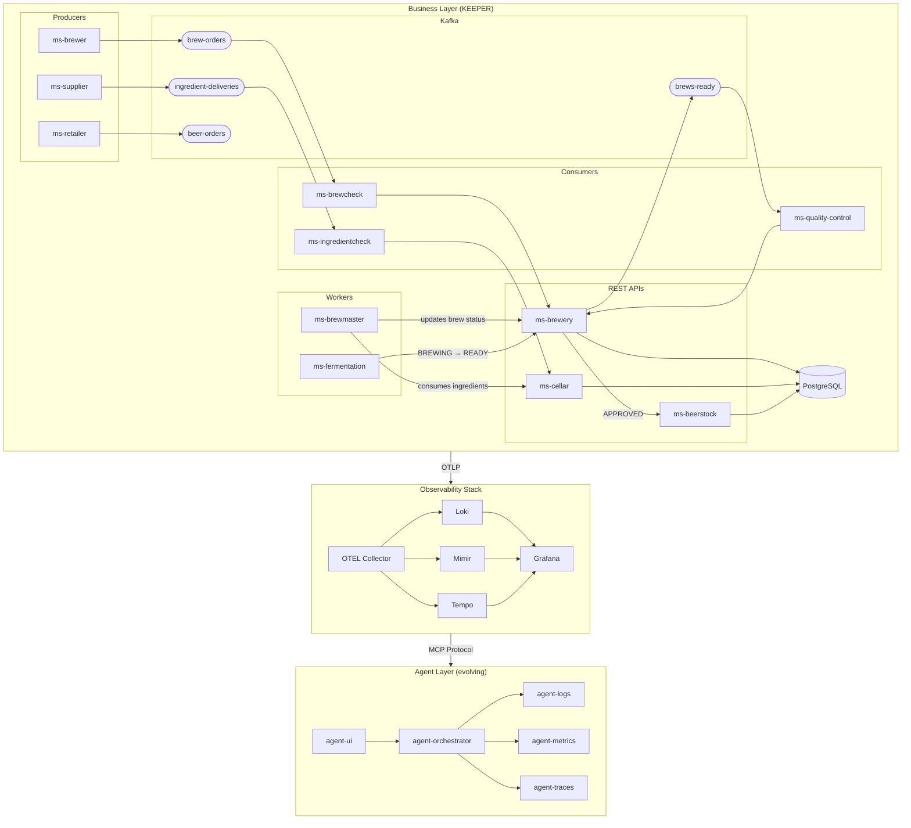

# Architecture

This project is a **personal learning lab** built in layers, each added as a new topic to explore.

## Two-Layer Design



## Services

### Business Layer (KEEPER)

| Service | Role | Tech |
|---------|------|------|
| `ms-brewer` | Generates brew orders → Kafka (`brew-orders`) | Kafka producer |
| `ms-supplier` | Generates ingredient deliveries → Kafka (`ingredient-deliveries`) | Kafka producer |
| `ms-retailer` | Simulates retailers placing beer orders → Kafka (`beer-orders`) | Kafka producer |
| `ms-brewcheck` | Validates & forwards brew orders to ms-brewery | Kafka consumer → REST |
| `ms-ingredientcheck` | Validates & forwards ingredient deliveries to ms-cellar | Kafka consumer → REST |
| `ms-quality-control` | Performs quality control on finished brews, approves or rejects | Kafka consumer → REST |
| `ms-brewery` | Brew management API | Flask + PostgreSQL |
| `ms-cellar` | Ingredient stock management API | Flask + PostgreSQL |
| `ms-beerstock` | Finished beer stock management API | Flask + PostgreSQL |
| `ms-brewmaster` | Fetches registered brews, consumes ingredients, updates brew status | Background worker |
| `ms-fermentation` | Monitors brews in BREWING status, transitions to READY on completion | Background worker |
| `lib-models` | Shared business models | Pydantic |
| `lib-ai` | Shared AI utilities (LLM config, MCP client) | LangChain |
| `config` | Infrastructure configuration files | YAML |

### Agent Layer (DRAFT — code written, not yet operational)

| Service | Role |
|---------|------|
| `agent-orchestrator` | Routes queries, coordinates agents, synthesizes responses |
| `agent-logs` | Queries Loki for log analysis |
| `agent-metrics` | Queries Mimir for metrics analysis |
| `agent-traces` | Queries Tempo for trace analysis |
| `agent-ui` | Web chat interface |

### Tools (ACTIVE)

| Service | Role |
|---------|------|
| `agent-traduction` | Language detection and translation |
| `benchmark` | LLM performance testing framework |

## Data Flow

```
Business services generate activity autonomously
        │
        ▼ OTLP (traces, metrics, logs)
OTEL Collector
        │
        ├──▶ Loki     (logs)
        ├──▶ Mimir    (metrics)
        └──▶ Tempo    (traces)
                │
                ▼
        Grafana (UI + MCP server)
                │ MCP Protocol
                ▼
        Agent layer reads observability data
        and answers natural language queries
```

## Infrastructure

- **Reverse proxy**: Traefik (port 8081)
- **Message broker**: Kafka
- **Database**: PostgreSQL
- **LLM runtime**: Ollama (local models)
- **Container**: Docker / Podman
- **Package manager**: UV
