---
# You can also start simply with 'default'
theme: dracula
title: Python & Otel demonstration

# random image from a curated Unsplash collection by Anthony
# like them? see https://unsplash.com/collections/94734566/slidev
background: https://cover.sli.dev
# some information about your slides (markdown enabled)
---

# Python & Otel demonstration

---
layout: center
---

# Agenda

- 📊🔍 Monitoring & Observability
- 📡 OpenTelemetry
- 📈 Grafana Stack
- 🎥 Live Demonstration

---
layout: center
---

# Some Questions 🤔

- In your opinion, what is monitoring 📊 and what is observability🔍?
- What exactly is OpenTelemetry (OTel)? 🤔
- Why should my application be equipped with monitoring and/or observability? 👀

---
layout: section
---

# 📊🔍 Monitoring & Observability

---
layout: image-left
image: /images/monitoring.webp
---

# Monitoring 📊

Monitoring focuses on **tracking key metrics** (like CPU, memory, error rates) over time to ensure systems are performing correctly.

**Alerts are triggered** if something goes wrong, helping teams react to known issues and maintain **system health**.

---
layout: image-left
image: /images/observability.webp
---

# Observability 🔍

Observability is about **understanding the inner workings** of a system by analyzing the data it produces (logs, metrics, traces).

It helps you **troubleshoot** unexpected issues and gives a deep, real-time view of system behavior.

In complex architectures, like microservices, observability helps you **follow the flow of requests** and pinpoint problems quickly.

---
layout: center
---

# Observability Pillars 🛠️

**Metrics** 📊: Quantitative data points measuring system performance (e.g., CPU, memory, error rates), helping to monitor trends and real-time health.

**Logs** 📜: Detailed, time-stamped records of system events, useful for debugging and understanding specific errors or issues.

**Traces** 🛤️: Visualize the path of requests through a system, breaking it down into operations (spans) to identify bottlenecks and performance issues in distributed systems.

Together, these pillars give deep visibility into system behavior, enabling faster troubleshooting and better performance management.

---
layout: section
---

# 📡 OpenTelemetry

---
layout: center
---

# OpenTelemetry Overview 🚀

OpenTelemetry is a **framework of tools**, **APIs**, and **SDKs** used to instrument, collect, and export telemetry data, helping to analyze software performance and behavior.

On the **client side** 🖥️, telemetry data is generated either automatically 🛠️ or manually via APIs/SDKs 💻.

On the **collector side** 📡, it handles data collection 📥, transformation 🔄, and export 🚚, providing continuous insights into your system's performance.

---
layout: image
image: https://opentelemetry.io/img/otel-diagram.svg
backgroundSize: 80%
---

---
layout: section
---

# 📈 Grafana Stack

---
layout: center
---

# Grafana 📊

Grafana is a versatile open-source platform for visualizing data from various sources

- Connects to multiple data sources like Prometheus, Loki, Mimir, and more 🌐
- Create fully **customizable dashboards** for real-time monitoring 📊
- Built-in **alerting** and collaboration tools to keep teams informed 🚨

---
layout: center
---

# Grafana Data Sources 🌟

Grafana integrates with specialized backends to store and analyze data

- **Mimir**: Stores and handles large-scale **metrics** 📈
- **Loki**: Optimized for managing **logs** efficiently 📜
- **Tempo**: Tailored for tracking and storing **traces** in distributed systems 🛤️

---

# Architecture overview

```mermaid
graph LR
    A[OpenTelemetry Agent] --> B[OpenTelemetry Gateway]
    G[OpenTelemetry SDK/API] --> B[OpenTelemetry Gateway]
    
    B --> C[Mimir - Metrics]
    B --> D[Loki - Logs]
    B --> E[Tempo - Traces]
    
    C --> F[Grafana - Visualization]
    D --> F[Grafana - Visualization]
    E --> F[Grafana - Visualization]
    
    style A fill:#333,stroke:#bbb,stroke-width:2px;
    style B fill:#444,stroke:#bbb,stroke-width:2px;
    style C fill:#555,stroke:#bbb,stroke-width:2px;
    style D fill:#666,stroke:#bbb,stroke-width:2px;
    style E fill:#777,stroke:#bbb,stroke-width:2px;
    style F fill:#888,stroke:#bbb,stroke-width:2px;
    style G fill:#333,stroke:#bbb,stroke-width:2px;
```

---
layout: cover
---

# It's Demo Time! 🚀👨‍💻

---
layout: cover
---

# Questions? 🤔💬
